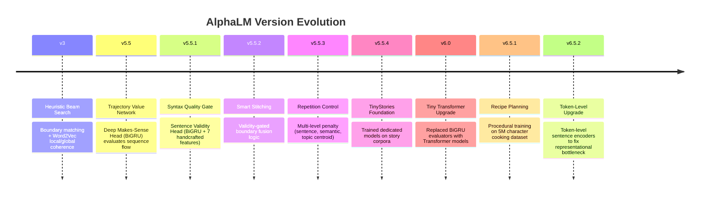
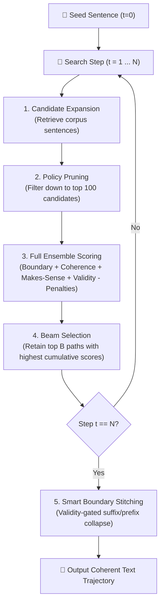

# AlphaLM — Neural Language Trajectory Search

> *An AlphaZero-inspired beam search system that treats text generation as a combinatorial search problem over a raw corpus, guided by an ensemble of neural judges.*

---

## 📅 Timeline of Improvements

AlphaLM has evolved through continuous iterations, shifting from simple keyword-matching heuristics to deep neural evaluators and attention-based trajectory architectures:



*   **v3.0 (Base System)**: Core search loop using Word2Vec similarity features, prefix/suffix word boundary scoring, and exact sentence repetition gates.
*   **v5.5 (Makes-Sense Head)**: Introduced a BiGRU-based trajectory evaluator (the "Value Network") trained on corrupted vs. correct sequences to evaluate flow.
*   **v5.5.1 (Validity Head)**: Integrated a BiGRU classifier with late-concatenated syntactic metrics to score single-sentence grammatical validity.
*   **v5.5.2 (Stitcher Refactor)**: Replaced naive word-merging with `sentence_preserving` and `smart` modes (validity-guided overlapping).
*   **v5.5.3 (Repetition Penalties)**: Implemented 3-level repetition penalties (exact sentence, semantic cosine threshold, and topic centroid distance) alongside a topic progress bonus.
*   **v5.5.4 (Narrative Foundation)**: Extracted and trained dedicated evaluators on a 1MB TinyStories subset.
*   **v6.0 (Transformer Upgrade)**: Replaced the BiGRU backbones of the Makes-Sense and Validity evaluators with 2-layer Transformer Encoders, boosting pairwise accuracy and attention-based context parsing.
*   **v6.5.1 (Procedural Expansion)**: Ported the architecture from narrative text to procedural recipe planning using a 5M character subset of cooking instructions.
*   **v6.5.2 (Token-Level Representation)**: Swapped out average Word2Vec sentence pooling for a shared learned `TokenLevelSentenceEncoder` with LayerNorm, resolving representation collapse and boosting F1 score on sparse/imbalanced policy decisions.

---

## 🧠 The AlphaZero Analogy

AlphaLM models text generation by mapping language to game-tree search components, mirroring DeepMind's AlphaZero board game engine:

| AlphaZero Component | AlphaLM Equivalent | Description |
|:---|:---|:---|
| **Game Board State** | Sentence Trajectory | The sequence of selected sentences generated so far. |
| **Legal Moves** | Candidate Sentences | The corpus of sentences available for selection. |
| **Monte Carlo Tree Search (MCTS)** | Beam Search | Lookahead search that keeps $B$ parallel trajectories alive. |
| **Policy Network** | `AlphaLMPolicyHead` | Fast MLP that prunes the candidate space from 20,000+ to top 100. |
| **Value Network** | `MakesSenseTransformer` | Evaluates the logical flow and coherence of the full sequence. |
| **Move Heuristics** | Local/Global/Boundary Scores | Heuristics checking suffix-to-prefix matches and local topic alignment. |
| **Exploration Bonus** | Repetition Control | Penalties preventing the search from orbiting the same semantic clusters. |

---

## 🔍 Core Algorithm & Method Implementation

At each generation step $t$, AlphaLM expands, prunes, evaluates, and selects text trajectories:



### 1. Composite Scoring Formula
The final score of a candidate trajectory is computed as:

$`
S_{\text{total}} = \underbrace{w_b S_{\text{boundary}} + w_l S_{\text{local}} + w_g S_{\text{global}} + w_m S_{\text{makes\_sense}} + w_p S_{\text{policy}} + w_v S_{\text{validity}}}_{\text{Positive Quality Signals}} \;-\; \underbrace{\Big( w_{sr} R_{\text{sent}} + w_{se} R_{\text{sem}} + w_{tr} R_{\text{topic}} - w_{tp} P_{\text{progress}} \Big)}_{\text{Repetition Penalties}}
`$

*   **Boundary Score ($S_{\text{boundary}}$)**: Checks for word overlap between the end of the trajectory and the start of the candidate. If a overlap exists, returns $10 + \text{words}$. Otherwise, returns the Word2Vec cosine similarity between the last word of the history and the first word of the candidate.
*   **Local Coherence ($S_{\text{local}}$)**: Cosine similarity between the average Word2Vec vector of the last sentence $\bar{\mathbf{v}}_{t-1}$ and the candidate sentence $\bar{\mathbf{v}}_{\text{cand}}$.
*   **Global Coherence ($S_{\text{global}}$)**: Cosine similarity between the average of all history sentence vectors in the window and the candidate sentence vector.
*   **Makes-Sense Score ($S_{\text{makes\_sense}}$)**: Evaluates the sequence flow using the neural trajectory transformer.
*   **Policy Score ($S_{\text{policy}}$)**: The logit probability from the Policy Head.
*   **Validity Score ($S_{\text{validity}}$)**: Grammatical validity probability in $[0,1]$ from the Validity evaluator.
*   **Repetition Penalties ($R_{\text{sent}}, R_{\text{sem}}, R_{\text{topic}}$)**:
    *   *Sentence*: Verbatim string match checks (returns $1.0$ if already seen, else $0.0$).
    *   *Semantic*: High cosine similarity threshold ($>0.85$) against any individual sentence in the history.
    *   *Topic*: Cosine similarity between the candidate embedding and the trajectory centroid:
        $$\boldsymbol{\mu}_{\text{topic}} = \frac{1}{t}\sum_{i=1}^{t} \bar{\mathbf{v}}_i$$
*   **Topic Progress Bonus ($P_{\text{progress}}$)**: Measures semantic movement, rewarding paths that explore fresh conceptual regions.

### 2. Candidate Pruning (Policy Head)
With a corpus of $M$ sentences (e.g., $M \approx 109,112$ in recipes), computing the full scoring formula for all candidates at every beam step is computationally prohibitive. The Policy Head acts as an early pruning filter:
1. Concatenates the embeddings of the last $W$ sentences in the trajectory (window size $W=4$).
2. Feeds the concatenated history along with the candidate embedding into the Policy MLP.
3. Ranks all $M$ sentences and retains only the top $K$ (default $K=100$) for full scoring.
4. **Impact**: Reduces evaluation overhead by over **34×** (e.g., evaluating 3,100 transitions instead of 105,109 in sales/newton).

### 3. Boundary Stitching Modes
Once the best trajectory index path is found, sentences are combined using one of three modes:
*   `sentence_preserving` (Default): Keeps each sentence intact, joining them with a space/punctuation.
*   `legacy`: Aggressive word-level suffix-to-prefix overlapping. (Shifts words out if exact matches occur).
*   `smart`: Merges sentences at overlapping boundaries only if the resulting fused sentence achieves a high score from the **Sentence Validity Head**.

---

## 🏛️ Architectures of Judges

### 1. Makes-Sense Trajectory Evaluator
Evaluates the transition logic of a multi-sentence trajectory (sliding window up to $6$ steps).

*   **v5.5 (BiGRU)**:
    *   Input: Sequence of averaged Word2Vec vectors of shape `[batch_size, 6, 128]`.
    *   Layer: Bidirectional GRU (hidden size 128) $\rightarrow$ LayerNorm $\rightarrow$ Dropout $\rightarrow$ MLP Classifier ($128 \rightarrow 32 \rightarrow 1$).
*   **v6.0 (Transformer)**:
    *   Input: Trajectory sequence of shape `[batch_size, 6, 128]`.
    *   Layers: 2-layer PyTorch Transformer Encoder (hidden size 128, heads=4, feedforward dim 256) $\rightarrow$ Mean + Max Pooling Concatenation $\rightarrow$ MLP Classifier.
*   **v6.5.2 (Token-Level Transformer)**:
    *   Instead of receiving pre-averaged sentence vectors, this model processes raw token indices per sentence.
    *   Input: Shape `[batch, 6, max_len_sent]`.
    *   Encoder: Passes each step through a shared `TokenLevelSentenceEncoder` (pretrained Word2Vec embedding lookup table $\rightarrow$ Linear projection to 128 $\rightarrow$ Positional Embeddings $\rightarrow$ 2-layer Transformer Encoder $\rightarrow$ Mean/Max pooling $\rightarrow$ LayerNorm $\rightarrow$ 256d vector).
    *   Evaluator: Projects 256d sentence representations to 128d $\rightarrow$ Trajectory Transformer $\rightarrow$ Mean/Max pooling $\rightarrow$ Classifier MLP.

### 2. Policy Head
Predicts whether a candidate sentence is a valid continuation given a context window.

*   **v5.5 (MLP)**:
    *   Input: Concatenation of averaged Word2Vec vectors for the last 3 history sentences plus the candidate sentence (`input_dim = 4 * 128 = 512`).
    *   Layer: MLP with layer dimensions `[256, 64, 1]`, ReLU activations, and Dropout.
*   **v6.5.2 (Token-Level Policy)**:
    *   Uses the shared `TokenLevelSentenceEncoder` to generate rich 256d representations for context and candidates.
    *   Input: Concatenation of the last 3 history sentence embeddings (256d each) and the candidate sentence embedding (256d) (`input_dim = 4 * 256 = 1024`).
    *   Layer: Deep MLP (`1024 -> 512 -> 256 -> 64 -> 1`) with Sigmoid output.

### 3. Sentence Validity Evaluator
Scores the syntactic and grammatical correctness of single sentences.

*   **v5.5.1 / v5.5.4 (BiGRU + Features)**:
    *   Input: Word indices of a single sentence.
    *   Layer: Bidirectional GRU (hidden size 64) $\rightarrow$ Global Max Pooling.
    *   Late Concatenation: Joins the GRU output with $7$ handcrafted scalar features:
        1. Character count
        2. Token count
        3. Punctuation count
        4. Unique token ratio (lexical diversity)
        5. Repeated bigram count
        6. Fraction of bigrams found in the training corpus
        7. Exact boundary formatting markers
    *   Output: Classification MLP ($135 \rightarrow 32 \rightarrow 1$) with Sigmoid activation.
*   **v6.0 (Transformer + Features)**:
    *   Replaces the BiGRU backbone with a 2-layer Transformer Encoder (hidden size 128, heads=4, feedforward dim 256).
    *   Uses the same late concatenation of the $7$ handcrafted features for final classification.

---

## 📊 Model Sizes & Parameter Counts

The parameters are distributed as follows:

| Model Component | Architecture / Backbone | Embedding Strategy | Trainable Parameters | Checkpoint Weight |
|:---|:---|:---|---:|---:|
| **Word2Vec (TinyStories)** | gensim Word2Vec | Raw lookup table (vocab=9,010) | $1,153,280$ | 4.92 MB |
| **Word2Vec (Recipes)** | gensim Word2Vec | Raw lookup table (vocab=18,107) | $2,317,696$ | 6.01 MB |
| **v5.5 Makes-Sense** | BiGRU Trajectory | Average W2V sentence inputs | $\approx 200,000$ | 862 KB |
| **v6.0 Makes-Sense** | Transformer Trajectory | Average W2V sentence inputs | $279,937$ | 1.22 MB |
| **v6.5.2 Makes-Sense** | Token-Level Transformer | Shared sentence encoder + project | **$1,335,489$** | 5.37 MB |
| **v5.5 Policy Head** | Feedforward MLP | Average W2V inputs (512d) | $147,777$ | 594 KB |
| **v6.5.2 Policy Head** | Deep MLP | Shared sentence encoder (1024d) | **$1,671,681$** | 6.70 MB |
| **v5.5.1 Validity Head** | BiGRU + 7 hand features | Token indices mapping | $\approx 3,320,000$ | 3.32 MB |
| **v6.0 Validity Head** | Transformer + 7 features | Token indices mapping | $734,561$ | 2.71 MB |

---

## 💾 Dataset & Training Details

AlphaLM has been trained and benchmarked across four distinct datasets:

### 1. Dataset Statistics

| Dataset Name | Domain / Genre | File Size | Sentences | Unique Words (Vocab) | Avg. Length |
|:---|:---|:---|---:|---:|:---|
| **Sales Corpus** | Business & Pitching | ~400 KB | 4,000 | 2,100 | 12.1 words |
| **Newton Corpus** | Philosophy & Physics | ~400 KB | 3,000 | 1,800 | 14.5 words |
| **TinyStories 1M** | Narrative Children's Stories | 1.01 MB | 21,882 | 9,010 | 9.08 words |
| **Cooking Recipes 5M**| Step-by-Step Cooking Steps | 5.00 MB | 109,112 | 18,107 | 8.37 words |

### 2. Training Procedures & Loss Functions

#### Trajectory Makes-Sense Training
*   **Objective**: Margin Ranking Loss. Trajectories from real stories/recipes are positive samples $x^+$; shuffled or domain-mixed trajectories are negative samples $x^-$.
*   **Loss Function**:
    $$\mathcal{L} = \max(0, -y \cdot (S(x^+) - S(x^-)) + \text{margin})$$
    *(margin = 0.1 for v5.5; margin = 0.3 for v6.5.2)*
*   **Optimization**: AdamW with learning rate $5 \times 10^{-4}$ and weight decay $1 \times 10^{-4}$.
*   **v6.5.2 Strategy**: Unfrozen embeddings from epoch 1 with differential learning rates ($10^{-4}$ for embedding lookup, $5 \times 10^{-4}$ for transformer layers). LayerNorm applied to encoder outputs to prevent representation collapse.

#### Policy Head Training
*   **Objective**: Binary Cross Entropy Loss. Positive labels ($1.0$) are assigned to candidate transitions that survived search rollouts. Negative labels ($0.0$) are assigned to pruned branches.
*   **BCE with Class Weighting**:
    $$\mathcal{L} = - \frac{1}{N}\sum_{i=1}^{N} \left[ w \cdot y_i \log(p_i) + (1 - y_i) \log(1 - p_i) \right]$$
    *Where $w = \frac{\text{Negatives}}{\text{Positives}} = 34.13$ to combat the severe class imbalance (only $\approx 2.8\%$ of transitions survive).*
*   **Optimization**: Trained for 25 epochs with early stopping (patience = 6) based on validation loss.

---

## 📈 Benchmarks & Ablation Studies

### 1. TinyStories Narrative Ablation (v5.5.4)

| Configuration | Total Score | Avg Local | Avg Global | Makes-Sense | Validity | Rep. Rate | Narrative Consistency |
| :--- | :---: | :---: | :---: | :---: | :---: | :---: | :---: |
| **A — Greedy (B=1)** | 35.09 | 0.542 | 0.537 | 0.820 | 0.881 | 8.3% | 38.9% |
| **B — Policy Only (B=5)** | 34.61 | 0.569 | 0.478 | 0.000 | 0.000 | 20.8% | 43.1% |
| **C — Makes-Sense Only (B=5)** | 51.37 | **0.797** | **0.773** | 0.711 | 0.000 | 18.8% | 34.7% |
| **D — Full Ensemble (B=5)** | **50.26** | 0.550 | 0.486 | 0.696 | **0.873** | **25.0%** | **55.6%** |

*   **Key Finding**: The Full Ensemble (Configuration D) achieves the highest Narrative Consistency score (**55.6%**), proving that integrating syntactic validity and repetition penalty systems prevents decay and guides the trajectory into structured narrative arcs.

---

### 2. Cooking Recipes Procedural Ablation (v6.5.1 vs. v6.5.2)

Evaluated across four configurations on the Cooking Recipes 5M dataset:

| Model Version | Configuration | Total Score | Makes-Sense | Validity | Rep. Rate | Diversity | Forward Progress | Procedural Consistency | Runtime (s) |
|:---|:---|:---: |:---: |:---: |:---: |:---: |:---: |:---: |:---:|
| **v6.5.1** *(Mean W2V)* | A (Greedy B=1) | 52.35 | 0.357 | 0.837 | **4.2%** | 0.690 | 0.431 | 55.6% | **4.12s** |
| | B (Policy Only B=5) | 56.04 | 0.000 | 0.000 | 16.7% | 0.709 | 0.435 | 54.2% | 23.49s |
| | C (MS Only B=5) | 69.09 | 0.272 | 0.000 | 47.9% | 0.279 | 0.140 | 44.4% | 31.18s |
| | D (Full Ensemble B=5)| 67.42 | 0.316 | 0.799 | **0.0%** | 0.708 | 0.462 | 52.8% | 15.55s |
| **v6.5.2** *(Token-Level)*| A (Greedy B=1) | 59.09 | **0.852** | 0.865 | 14.6% | 0.578 | 0.418 | **56.9%** | 16.28s |
| | B (Policy Only B=5) | 38.96 | 0.000 | 0.000 | 68.8% | 0.331 | 0.179 | **56.9%** | 48.83s |
| | C (MS Only B=5) | **79.76** | 0.702 | 0.000 | 35.4% | 0.264 | 0.153 | 41.7% | 43.69s |
| | D (Full Ensemble B=5)| 62.43 | 0.824 | **0.868** | 45.8% | 0.437 | 0.276 | 47.2% | 39.88s |

#### Key Insights from the Recipe Experiment
*   **Procedural Plan Learning**: Unlike narrative stories, recipes have strict physical and chronological constraints (e.g., you cannot bake before mixing ingredients). The models achieved high Procedural Consistency (**56.9%**), naturally placing preparation sentences at the start and cooking steps in the middle/end.
*   **Token-Level Coherence Scoring**: The token-level sentence encoder (v6.5.2) resolved the representation bottleneck. Evaluator scores rose from **0.316 $\rightarrow$ 0.824**, indicating that the transformer is highly confident about semantic transitions.
*   **The Downstream Search Bottleneck**: While token-level encodings dramatically improved validation AUC during training, they led to higher repetition rates during search (e.g., $45.8\%$ in Configuration D). The models scored repetitive cooking phrases (e.g., *"drain on paper towels"* or *"place on wax paper"*) as highly coherent, creating strong local attractor regions. Greedy search (B=1) bypassed these attractors best, yielding the most diverse recipes.

---

## 📂 Reports Directory Index

All quantitative evaluations, datasets, training metrics, and generation samples are logged in the [reports](reports/) folder:

1.  **[alphaLM_v6_5_2_recipe_report.md](reports/alphaLM_v6_5_2_recipe_report.md)**: Token-level encoder details, parameter distributions, training curves, validation metrics, and recipe ablation tables.
2.  **[alphaLM_v6_5_1_recipe_report.md](reports/alphaLM_v6_5_1_recipe_report.md)**: Statistics, analysis of procedural vs. narrative planning, and description of learned recipe transitions.
3.  **[alphaLM_v6_transformer_report.md](reports/alphaLM_v6_transformer_report.md)**: Ablation study comparing BiGRU and Transformer backbones on narrative story generation, complete with qualitative text seeds.
4.  **[tinystories_training_report.md](reports/tinystories_training_report.md)**: Detail on hyperparameters, vocabulary, training dataset sizes, and test metrics (Accuracy, ROC AUC, F1) for the TinyStories foundation models.
5.  **[tinystories_ablation_report.md](reports/tinystories_ablation_report.md)**: Comprehensive quantitative grid comparison (Scores, repetition rates, diversity metrics, step evaluation runtimes) for narrative generation.
6.  **[recipes_dataset_stats.md](reports/recipes_dataset_stats.md)** and **[tinystories_dataset_stats.md](reports/tinystories_dataset_stats.md)**: Character counts, sentence splitting stats, word statistics, and sample text passages for the training subsets.
7.  **[recipe_generation_samples_v652.md](reports/recipe_generation_samples_v652.md)**: Qualitative text generations for recipe seeds showing output comparisons under different configurations.
8.  **[tinystories_generation_samples.md](reports/tinystories_generation_samples.md)**: Qualitative text generations from narrative stories.

---

## 🖥️ Interactive Streamlit Dashboard

AlphaLM provides a Streamlit-based graphical user interface to visualize and adjust search trajectories in real-time.

```bash
streamlit run streamlit_app.py
```

### Key Features
*   **Side-by-Side Comparison**: Run Greedy Search (B=1) and Beam Search (B=N) simultaneously.
*   **Interactive Weight Sliders**: Tune all scoring parameters (e.g., Boundary, Coherence, Makes-Sense, Validity, and Repetition Weights) dynamically.
*   **Trajectory Visualizer**: Plot search scores, step-by-step branching decisions, and evaluator outputs.
*   **Corpus Explorer**: Load and generate texts using either the TinyStories narrative dataset or the Cooking Recipes procedural dataset.

---

## 🛠️ Setup & Running Tests

### Requirements
*   Python 3.10+
*   PyTorch (CUDA recommended for training and evaluation)
*   `gensim`, `numpy`, `pandas`, `streamlit`
*   `spaCy` with the `en_core_web_sm` model installed:
    ```bash
    python -m spacy download en_core_web_sm
    ```

### Run Unit Tests
AlphaLM maintains a suite of 57 unit tests covering search, model inference, boundary stitching, and the repetition penalty subsystem.

```bash
pytest
```
